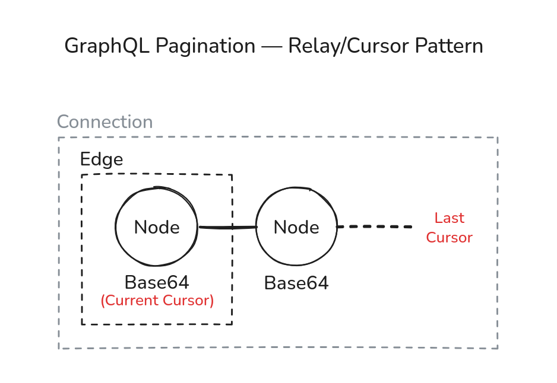
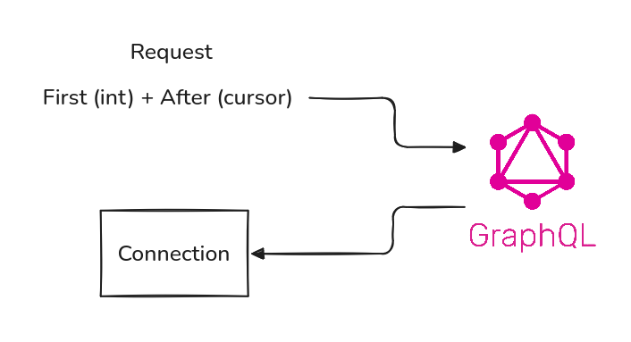

# Spring GraphQL Sandbox

Study project creating a GraphQL API with Spring Boot.

## Pagination

GraphQL has a special — and native — Pagination model. The Relay/Cursor Pattern is usually useful for infinite scroll features and for paginating data with constant updates.

